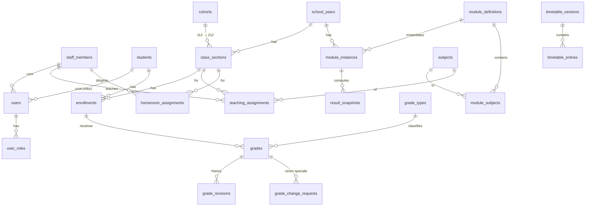

# Arhitectură – Catalog electronic SMMMFN

**Școala Militară de Maiștri Militari a Forțelor Navale „Amiral Ion Murgescu”**

Status: **PROPOSAL v0.1 (2026-09-23)** – design only, no code yet.
This document is written in English for developers; every user-facing string in the application is Romanian.

---

## 1. Repository state (at time of writing)

| Item | Finding |
|---|---|
| Local folder `Catalog SMMMFN` | Empty – no source, no package files, no config, no docs |
| GitHub `TiGabriel/Catalog-SMMMFN` | Empty repository, default branch `main`, no commits |
| Existing stack / DB / env files | None |

Conclusion: the project is designed from scratch. There is no existing work to preserve.

---

## 2. Recommended technology stack

| Layer | Choice | Why |
|---|---|---|
| Language | **TypeScript** (strict) everywhere | One language front+back, shared validation schemas, type safety |
| Runtime | **Node.js 22 LTS** | LTS support, mature ecosystem |
| Backend API | **Fastify 5** + `@fastify/helmet`, `@fastify/rate-limit`, `@fastify/cookie`, `@fastify/multipart` | Fast, small, explicit plugin model; easy to put *one* authorization layer in front of every route |
| Validation | **Zod** (schemas shared in `packages/shared`) | Same schema validates on client (UX) and server (security) |
| Database | **PostgreSQL 16+** | Transactions, CHECK constraints, partial unique indexes, JSONB for audit payloads, triggers to make audit append-only, optional Row-Level Security later |
| ORM / migrations | **Prisma** (+ raw SQL migrations for triggers/grants) | Parameterized queries by default (no SQL injection), versioned migrations |
| Password hashing | **Argon2id** (`argon2` package) | Current OWASP recommendation |
| Frontend | **React 19 + Vite** SPA, **React Router**, **TanStack Query** | No server secrets in the client, simple static deployment |
| UI | **Tailwind CSS** + **Radix UI / shadcn-style** components, **Inter** font (self-hosted), **lucide** icons | Accessible primitives, dark/light theming via CSS variables, modern look |
| Excel | **ExcelJS** | Generate timetable template and parse uploads (read values only, never formulas/macros) |
| Reports | XLSX via ExcelJS; PDF later (e.g. server-side HTML→PDF) | Printable class tables |
| Tests | **Vitest** (unit + API via `fastify.inject`), **Playwright** (E2E) | Authorization matrix tests are mandatory |
| Deployment | **Docker Compose**: `caddy` (TLS, reverse proxy, serves SPA) + `api` + `postgres` | Single same-origin domain (`/` = SPA, `/api` = API) → no CORS, strict cookies |
| CI | GitHub Actions: lint, typecheck, tests, `npm audit`, Dependabot, secret scanning | |
| Package manager | **pnpm** workspaces (monorepo) | |

**Why not Next.js / full-stack framework?** A separate API with a single server-side authorization layer makes "never trust the frontend" structural: the SPA contains no secrets and no authorization logic that matters; every decision happens in the API. It also avoids framework-specific pitfalls (middleware-based auth bypasses, server-action CSRF subtleties).

### 2.1 Repository layout (target)

```
/apps
  /api                 Fastify API
    /src
      /config          env parsing (zod), constants
      /plugins         security headers, session, csrf, rate-limit, error handler
      /auth            login/logout, password policy, lockout
      /authz           permissions.ts, scope.service.ts, policies/*
      /audit           audit.writer.ts (transactional), audit queries
      /modules         users, staff, students, structure (years/classes/subjects/modules),
                       assignments, grades, grade-requests, results (averages),
                       timetable, reports, rollover
      /jobs            scheduled jobs (rollover on 1 Sept, cleanup of expired sessions)
    /prisma            schema.prisma, migrations (+ raw SQL for triggers & grants)
  /web                 React SPA
    /src
      /i18n/ro.ts      ALL Romanian UI strings (single source)
      /theme           design tokens, dark/light
      /components/ui   buttons, cards, tables, dialogs…
      /features/*      one folder per feature
/packages
  /shared              zod schemas, enums, permission names, DTO types (no secrets)
/docs                  ARCHITECTURE.md, later: SECURITY.md, TIMETABLE_TEMPLATE.md
/infra                 docker-compose.yml, Caddyfile, backup scripts
PROJECT_STATUS.md
```

---

## 3. Application architecture

```
Browser (React SPA, ro)  ──HTTPS──►  Caddy (TLS, HSTS, static SPA)  ──►  Fastify API  ──►  PostgreSQL
                                                                            │
                                         every request: session → actor → permission → scope check
                                                                            │
                                         every mutation: domain change + audit row in ONE transaction
```

Request pipeline in the API (order matters):

1. Security headers (CSP, HSTS, X-Frame-Options DENY, Referrer-Policy, no-sniff).
2. Rate limit (global + stricter on `/api/auth/*`).
3. Session resolution: opaque session id cookie → `sessions` table → `actor` (user, roles, staff/student id). Idle + absolute timeout.
4. CSRF check for state-changing methods (Origin check + synchronizer token header).
5. Input validation (zod) of params, query, body. Unknown fields rejected.
6. **Authorization**: permission check (role → permission) **and** scope check (does this actor have this class/subject/student in scope for this school year?). Deny by default. Out-of-scope resources return **404** (no existence leak) and write an `ACCESS_DENIED` audit row.
7. Service/domain logic in a DB transaction; audit entry written in the same transaction.
8. Response DTO mapping (explicit field allow-list; never return password hashes, internal role names to non-admins, etc.).
9. Central error handler: generic Romanian message + correlation id; details only in server logs.

---

## 4. Domain / database model

Conventions: UUID (v7) primary keys; `created_at/updated_at timestamptz` (UTC; displayed in Europe/Bucharest); **no hard deletes** for anything historical – use `status`, `valid_from/valid_to`, `deleted_at`. Romanian collation (ICU `ro-RO`) for name sorting.

### 4.1 People and accounts (identity ≠ account)

The key idea: **a person's historical identity is separate from their login account**, so accounts can be disabled/removed while grades, assignments and audit stay linked to the person.

| Entity | Main fields | Notes |
|---|---|---|
| `staff_members` | id, first_name, last_name, rank (nullable → civilian), employment_type (MILITAR / CIVIL_CONTRACTUAL), status (ACTIVE/LEFT), left_at | Teachers, homeroom teachers, commandant, admins. Never deleted. |
| `students` | id, first_name, last_name, rank (nullable), matricol_number (unique), status (ENROLLED / GRADUATED / WITHDRAWN / TRANSFERRED / EXPELLED), graduated_at | Never deleted. |
| `users` | id, username (unique among non-deleted), password_hash, staff_member_id?, student_id?, status (ACTIVE / INACTIVE / LOCKED / DELETED), must_change_password, failed_login_count, locked_until, last_login_at, password_changed_at | Exactly one of staff_member_id / student_id. "Delete account" = status DELETED + credential scrub; row kept for audit references. |
| `user_roles` | user_id, role, granted_by, granted_at, revoked_at | Roles: `ADMINISTRATOR`, `COMANDANT_UNITATE`, `PROFESOR`, `ELEV`. Revocations are kept (history). |
| `sessions` | id (hash of token), user_id, created_at, last_seen_at, expires_at, ip, user_agent, revoked_at | Server-side sessions. |
| `password_history` (optional) | user_id, password_hash, created_at | Prevent reuse of last N passwords (configurable). |

> **DIRIGINTE is not a stored role.** It is derived from an active `homeroom_assignments` row for the current school year. This guarantees the homeroom teacher gains access only to *that* class, and loses it automatically when the assignment ends.
> Display name for `COMANDANT_UNITATE` is exactly **"COMANDANT UNITATE"**.

### 4.2 Academic structure

| Entity | Main fields | Notes |
|---|---|---|
| `school_years` | id, name ("2026–2027"), start_date (1 Sept), end_date (31 Aug), status (PLANNED / ACTIVE / CLOSED) | Only one ACTIVE. CLOSED = read-only. |
| `study_years` (reference) | 1, 2 | "anul I", "anul II" |
| `companies` | id, name ("Compania 1"), study_year, valid_from_school_year | Default mapping: Compania 1 = anul II, Compania 2 = anul I. Kept as data because it may change. |
| `specializations` | id, code, name, active | Meaning of the class-code middle digit (1x vs 2x) – **to be confirmed** (see §11). |
| `cohorts` (promoții) | id, entry_school_year_id, class_suffix ("12", "24"…), specialization_id, expected_graduation_year | Stable identity of a class group across both years. |
| `class_sections` | id, school_year_id, cohort_id, study_year, code (e.g. "112" / "212"), company_id, status | One row **per school year**. Code = study_year digit + cohort suffix. 112 (2026–27) and 212 (2027–28) are two rows of the same cohort → old classes stay intact. |
| `enrollments` | id, student_id, class_section_id, school_year_id, status (ACTIVE / PROMOTED / GRADUATED / REPEATING / WITHDRAWN / TRANSFERRED), start_date, end_date | A student's history = list of enrollments. Grades point to an enrollment. |
| `subjects` | id, code, name, kind (CULTURA_GENERALA / SPECIALITATE / PREGATIRE_PRACTICA), active | Deactivate, never delete. |
| `module_definitions` | id, name, study_year, specialization_id?, sequence_no, has_final_exam | Curriculum template (which modules exist). |
| `module_subjects` | module_definition_id, subject_id, hours?, coefficient? | Which subjects belong to which module. |
| `module_instances` | id, module_definition_id, school_year_id, start_date, end_date, status (PLANNED / OPEN / GRADING_CLOSED / FINALIZED) | Concrete module in a given year; its status controls grade editability. |

### 4.3 Assignments (versioned, never overwritten)

| Entity | Main fields | Notes |
|---|---|---|
| `teaching_assignments` | id, school_year_id, staff_member_id, class_section_id, subject_id, module_instance_id?, valid_from, valid_to, created_by, ended_by, end_reason | A change = end the old row (valid_to) + create a new one. Old assignments remain for history. |
| `homeroom_assignments` | id, school_year_id, class_section_id, staff_member_id, valid_from, valid_to | Diriginte. At most one active per class (partial unique index). |

### 4.4 Grades

| Entity | Main fields | Notes |
|---|---|---|
| `grade_types` | id, code, label ("Testare", "Ascultare", "Activitate la clasă", "Caiet", "Proiect", "Altă activitate"), applicable_categories[], sort_order, active | Admin-configurable; deactivate instead of delete. May later carry a weight. |
| `grades` | id, category (**SUBJECT / CONDUCT / PRACTICAL_TRAINING / MODULE_EXAM**), enrollment_id, student_id, class_section_id, school_year_id, module_instance_id, subject_id (null for CONDUCT), grade_type_id, value NUMERIC(4,2) CHECK 1–10, grade_date, note, **author_staff_member_id** (original teacher, immutable), teaching_assignment_id / homeroom_assignment_id (authority used), created_by_user_id, created_at, status (ACTIVE / DELETED), version, deleted_at, deleted_by_user_id, deletion_reason | Denormalized context columns make scoped queries and audit simple. Integer-only vs. decimals is enforced per category by configuration (default: integers for regular grades). |
| `grade_revisions` | id, grade_id, version, value, grade_type_id, grade_date, changed_by_user_id, changed_at, change_kind (CREATE / UPDATE / DELETE / RESTORE), reason, change_request_id? | Append-only full history of every grade. |
| `grade_change_requests` | id, grade_id? (null for a late addition), request_type (CORRECTION / DELETION / LATE_ENTRY), proposed_values jsonb, reason, requested_by_user_id, requested_at, status (PENDING / APPROVED / REJECTED / CANCELLED), reviewed_by_user_id, reviewed_at, review_comment, applied_at | "Special" requests for cases outside the normal edit window; reviewed by COMANDANT UNITATE. On approval the change is applied automatically in the same transaction and linked to the request. |

### 4.5 Results / averages (rules configurable)

| Entity | Main fields | Notes |
|---|---|---|
| `averaging_rule_sets` | id, name, version, scope (school_year / study_year / specialization / subject kind), definition jsonb (validated by zod), effective_from, created_by, status (DRAFT / ACTIVE / RETIRED) | Never edited once used – a new version is created. |
| `result_snapshots` | id, module_instance_id, class_section_id, rule_set_id + version, computed_at, computed_by, status (PREVIEW / FINAL) | A computation run. |
| `result_lines` | snapshot_id, enrollment_id, subject_id? / category, value, details jsonb | Final grade per subject, conduct, practical training, module exam, module average. |

Calculation is a **strategy registry** in code (e.g. `arithmetic_mean`, `weighted_by_grade_type`, `mean_plus_exam_weight`, rounding modes, minimum number of grades, handling of conduct/practical). The JSON definition picks strategies and parameters. **FINAL snapshots are frozen**, so changing rules later never silently rewrites historical results.

### 4.6 Timetable

| Entity | Main fields | Notes |
|---|---|---|
| `bell_schedules` / `time_slots` | school_year_id, weekday?, slot_no, start_time, end_time | "Ora 1: 08:00–08:50" |
| `rooms` (optional) | id, name | |
| `timetable_imports` | id, file_name, file_sha256, stored_file_ref, uploaded_by, uploaded_at, status (UPLOADED / VALIDATED / REJECTED / PUBLISHED / SUPERSEDED), validation_report jsonb | Keeps the original file for traceability. |
| `timetable_versions` | id, import_id?, kind (BASE = recurring weekly / WEEK_OVERRIDE), valid_from (Monday), valid_to, week_parity? (A/B, optional), published_at, published_by | |
| `timetable_entries` | version_id, weekday, time_slot_id, class_section_id, subject_id, staff_member_id, room_id?, teaching_assignment_id (resolved), note | |

Selecting week *W*: use the published `WEEK_OVERRIDE` covering *W* if present, otherwise the published `BASE` version whose validity covers *W*. See §8.

### 4.7 Audit

| Entity | Main fields |
|---|---|
| `audit_log` | id bigserial, occurred_at, **actor_user_id**, **actor_snapshot** jsonb (name, rank, username, roles at the time), action, outcome (SUCCESS / FAILURE / DENIED), entity_type, entity_id, student_id?, class_section_id?, subject_id?, school_year_id?, old_values jsonb, new_values jsonb, reason, change_request_id?, ip inet, user_agent, session_ref (hashed), request_id, prev_hash, hash |

Details in §6.

### 4.8 Configuration

| Entity | Notes |
|---|---|
| `system_settings` | key, value jsonb (schema-validated), updated_by, updated_at. Every change audited. E.g. teacher edit window, session timeouts, lockout thresholds, rollover date, grade decimals per category. |

### 4.9 Simplified ER overview



---

## 5. Roles and permissions

### 5.1 Model

- **Permissions** are fine-grained constants defined in code (`packages/shared/permissions.ts`), e.g. `grades.create`, `grades.update_own`, `audit.read`, `users.manage`.
- **Role → permission mapping** is static in code (reviewed via Git, covered by tests). It is intentionally *not* editable from the UI, to avoid privilege escalation via configuration.
- **Scope** is computed server-side per request by `ScopeService` for the active (or requested) school year:
  - teaching pairs `(class_section_id, subject_id)` from active `teaching_assignments`;
  - homeroom `class_section_id`s from active `homeroom_assignments`;
  - own `enrollment_id` for ELEV.
- Every endpoint calls a **policy** `authorize(actor, action, resource)` = permission ∧ scope ∧ state (e.g. module not finalized, school year not closed). No endpoint queries data without passing through a scoped repository function.
- A user may hold several roles (e.g. a teacher who is also IT administrator) – **to be confirmed**; if allowed, separation of duties still applies per action (an admin-teacher edits grades only via his teaching scope, never via admin screens).
- Role names are never sent to non-admin clients. `/api/me` returns only display name, rank and a list of *capabilities* used to build the menu (e.g. `["timetable.view_own", "grades.enter"]`). Menus are cosmetics; the API enforces.

### 5.2 Permission matrix (v1)

Legend: ✅ full · 🔸 scoped · ❌ none

| Capability | ADMINISTRATOR | COMANDANT UNITATE | PROFESOR | DIRIGINTE (derived) | ELEV (future) |
|---|---|---|---|---|---|
| Manage users, reset passwords, activate/deactivate | ✅ | ❌ | ❌ | ❌ | ❌ |
| See internal roles | ✅ | ❌ (own hidden) | ❌ | ❌ | ❌ |
| Manage school years, classes, subjects, modules, grade types | ✅ | ❌ | ❌ | ❌ | ❌ |
| Manage teacher & homeroom assignments | ✅ | ❌ | ❌ | ❌ | ❌ |
| Import / publish timetable | ✅ | ❌ | ❌ | ❌ | ❌ |
| System configuration, averaging rules | ✅ | ❌ | ❌ | ❌ | ❌ |
| View timetable | ✅ all | ✅ all | 🔸 own | 🔸 own + homeroom class | 🔸 own class |
| View classes / student lists | ✅ (structure only) | ✅ all | 🔸 assigned classes | 🔸 homeroom class | ❌ |
| View grades | ❌ by default* | ✅ all | 🔸 own subject × assigned class | 🔸 all subjects of homeroom class | 🔸 own |
| Create grades | ❌ | ❌ | 🔸 assigned subject × class | 🔸 conduct for homeroom class (+ teacher scope if assigned) | ❌ |
| Modify / delete own grades (with reason, in window) | ❌ | ❌ | 🔸 | 🔸 own conduct grades | ❌ |
| Submit special correction/deletion request | ❌ | ❌ | 🔸 own grades | 🔸 own grades | ❌ |
| Approve / reject special requests | ❌ | ✅ | ❌ | ❌ | ❌ |
| Reports (module class table etc.) | ❌ by default* | ✅ all | 🔸 own subjects | 🔸 homeroom class | ❌ |
| Audit log | ✅ | ✅ | ❌ | ❌ | ❌ |

\* Whether the administrator may *read* grades/reports (e.g. for support) is an open question; default is deny. The administrator **never** has write access to grades.

Additional rules:
- The last active ADMINISTRATOR cannot be deactivated or lose the role.
- An admin cannot approve special requests; the commandant cannot approve their own request (not applicable in v1, but enforced generically: requester ≠ reviewer).
- Deactivating a user revokes all their sessions immediately.

---

## 6. Grade lifecycle and audit model

### 6.1 Grade lifecycle

```
             create (teacher in scope, module OPEN)
                        │
                        ▼
   ┌──────────────► ACTIVE ──── delete (reason) ────► DELETED (soft, kept)
   │                  │
   │   update (reason, own grade, inside edit window, module OPEN)
   │                  │
   └──────────────────┘
Outside window / module GRADING_CLOSED / year CLOSED:
   teacher → grade_change_request (reason) → COMANDANT UNITATE approve/reject → applied automatically if approved
FINALIZED module: grades immutable except via approved request, which also invalidates the FINAL snapshot and forces recomputation (audited).
```

- Only the **author** can modify/delete a grade directly. A new teacher taking over the class cannot edit the previous teacher's grades (they can request a correction – configurable).
- `author_staff_member_id` never changes; the history of authorship is permanent even if the account is deleted.
- Each change: new `grade_revisions` row + `audit_log` row + update of `grades` (with optimistic concurrency on `version`), all in one transaction.
- Reason is mandatory (min length configurable) for UPDATE, DELETE and requests; stored in revision and audit.

### 6.2 Audit events

`AUTH_LOGIN_SUCCESS`, `AUTH_LOGIN_FAILED`, `AUTH_LOCKED`, `AUTH_LOGOUT`, `AUTH_SESSION_EXPIRED`, `PASSWORD_CHANGED`, `PASSWORD_RESET_BY_ADMIN`, `USER_CREATED`, `USER_UPDATED`, `USER_ROLE_GRANTED/REVOKED`, `USER_DEACTIVATED/DELETED`, `ASSIGNMENT_CREATED/ENDED`, `HOMEROOM_ASSIGNED/ENDED`, `GRADE_CREATED`, `GRADE_UPDATED`, `GRADE_DELETED`, `GRADE_REQUEST_SUBMITTED/APPROVED/REJECTED/CANCELLED/APPLIED`, `TIMETABLE_IMPORTED/PUBLISHED`, `CONFIG_CHANGED`, `RULESET_CHANGED`, `MODULE_STATUS_CHANGED`, `RESULTS_FINALIZED`, `SCHOOL_YEAR_ROLLOVER`, `ACCESS_DENIED`, `EXPORT_GENERATED`.

Grade update rows contain: timestamp, actor + snapshot, student, class, subject, old value, new value, grade type, reason, action, IP, user-agent, session ref. Grade deletions also contain the deleted grade and approval info (request id, reviewer) when applicable.

### 6.3 Audit integrity

1. Written **in the same DB transaction** as the change → no change without audit.
2. PostgreSQL: the application DB role has only `INSERT, SELECT` on `audit_log`; a trigger rejects `UPDATE`/`DELETE`/`TRUNCATE` for every role except a separate, offline maintenance role.
3. **Hash chain** (`hash = sha256(prev_hash || canonical_row)`) → tampering detectable; a verification job/report exists for the commandant/admin.
4. Never exposed to non-admin/non-commandant roles (no endpoint, not just hidden UI).
5. Audit is filterable (date, user, class, subject, student, action) and exportable; exports are themselves audited.
6. Partitioning by year may be added later; records are archived, never deleted.

---

## 7. Academic year and history model

### 7.1 Annual rollover (1 September, configurable)

A **rollover job** runs on the configured date (default 1 Sept) and can also be launched manually. It is transactional, idempotent (safe to re-run) and fully audited. It supports a **dry run** so the admin can preview the result beforehand.

1. Create/activate the new `school_year`; set the previous one to CLOSED (read-only).
2. For every anul I cohort: create its anul II `class_section` (112 → 212), copy active students' enrollment (`PROMOTED` on the old enrollment, new `ACTIVE` enrollment in 212).
3. For every anul II cohort: close enrollments as `GRADUATED`, set `students.status = GRADUATED`; optionally set their user accounts to INACTIVE (removal later is a separate, audited admin action; academic records remain).
4. Exceptions flagged before rollover (repeating, withdrawn, transferred students) are honoured instead of auto-promotion.
5. Teaching/homeroom assignments are **not** copied automatically (they are ended with the year); the admin may use a "copy assignments from previous year" helper that proposes them for review.
6. New anul I classes (111…125) for the incoming cohort are created from the configured class list; students are added/imported by the admin.

### 7.2 History guarantees

- Nothing referenced by history is hard-deleted: students, staff, users, classes, subjects, assignments, grades, audit.
- Closed years are read-only for everyone; changes only through approved special requests (configurable, maybe disabled for closed years).
- Deleted teacher accounts: `users.status = DELETED`, credentials scrubbed; `staff_members` row stays, so grades show the original author name.
- Graduated students: enrollments, grades and result snapshots remain; the account (if any) can be removed.

---

## 8. Timetable architecture

1. **Template**: the API generates a downloadable `.xlsx` template pre-filled with valid lists (data validation dropdowns) of classes, subject codes, teacher codes, time slots. Proposed default format (to be finalized with the school): one "long" sheet, one row per lesson:
   `Clasa | Ziua (Luni…Vineri) | Ora (nr.) | Cod disciplină | Cod profesor | Sala | Săptămâna (opțional: data de luni / A/B) | Observații`.
   A grid-per-class sheet may be supported later as an alternative input; both map to the same internal model.
2. **Upload** (admin only): size limit (e.g. 2 MB), `.xlsx` only (no `.xlsm`), MIME + magic bytes check, decompression limits, only cell *values* read (formulas ignored).
3. **Validation**: every row checked against master data → report in Romanian with row numbers (unknown class, subject not assigned to that teacher for that class, teacher double-booked, class double-booked, room conflict). Warnings vs blocking errors.
4. **Preview → Publish**: admin reviews per class/teacher, chooses validity (from week X, until week Y, or single-week override) and publishes. Previous overlapping version becomes SUPERSEDED (kept).
5. **Display**: week picker (ISO week, Monday–Friday), resolved server-side per viewer's scope: teacher → own lessons; diriginte → own + homeroom class; commandant/admin → any class/teacher; student → own class.
6. **Future attendance** hangs off *lesson occurrences* = timetable entry × concrete date (materialized on demand), which the timetable model already supports.

---

## 9. Security-critical components

| Component | Measures |
|---|---|
| Authentication | Argon2id (tuned params); generic error "Utilizator sau parolă incorecte"; constant-time path for unknown users; password policy (≥ 8, uppercase, digit, special; configurable, + blocklist of common passwords); `must_change_password` after admin reset; no self-registration |
| Brute force | Per-IP and per-username rate limits; progressive delay; temporary lockout after N failures (configurable); all failures audited |
| Sessions | Opaque random token (≥ 256-bit), only its hash stored; cookie `__Host-sid`, `HttpOnly`, `Secure`, `SameSite=Strict`, `Path=/`; rotation on login and privilege change; idle (e.g. 30 min) and absolute (e.g. 12 h) timeouts; server-side logout; revocation on password change/deactivation |
| CSRF | SameSite=Strict + Origin/Referer check + synchronizer token in header for all non-GET requests |
| Authorization | Central `authz` module, deny-by-default, permission + scope + state; scoped repositories; 404 on out-of-scope; `ACCESS_DENIED` audited; **automated authorization matrix tests** (each role × each endpoint × in/out of scope) |
| Input validation | Zod on every input; UUID/enum/range checks; grade value CHECK constraint in DB as second line |
| SQL injection | Prisma parameterized queries only; raw SQL only via tagged templates, reviewed |
| XSS | React escaping, no `dangerouslySetInnerHTML`; strict CSP (no inline scripts); sanitize text fields on output in exports |
| File uploads | Timetable only: size/type/magic-byte checks, zip-bomb limits, value-only parsing, stored outside web root |
| Exports | CSV/XLSX formula-injection protection (prefix `=,+,-,@`), exports audited |
| Error handling | Generic messages + correlation id; no stack traces/SQL in responses; structured server logs without passwords/tokens |
| Secrets | `.env` never committed (`.env.example` only), secrets via environment/Docker secrets; GitHub secret scanning |
| Database | Separate roles: migration owner vs app role (least privilege; no DDL, no audit UPDATE/DELETE); TLS to DB if remote; encrypted, tested backups |
| Transport / headers | HTTPS only (Caddy, automatic TLS), HSTS, CSP, X-Frame-Options DENY, Referrer-Policy, Permissions-Policy |
| Supply chain | Lockfile, Dependabot, `npm audit` in CI, pinned Docker images |
| Recommended later | TOTP 2FA for ADMINISTRATOR and COMANDANT UNITATE; optional PostgreSQL Row-Level Security as defense in depth |

---

## 10. UI/UX direction

- Romanian everywhere; all strings in `i18n/ro.ts` (no hard-coded text in components); dates `dd.MM.yyyy`, Europe/Bucharest; correct diacritics (ș, ț with comma below).
- Visual identity: deep navy (`#0B1F3A`-ish) primary, naval blue accents, light neutral surfaces; dark mode via CSS variables with contrast ≥ WCAG AA; theme toggle + system preference.
- Inter (self-hosted) sans-serif; clear hierarchy (page title, section, table header); no monospace in normal UI.
- Rounded cards/buttons (radius 12–16 px), subtle shadows, restrained hover/focus animations (respect `prefers-reduced-motion`).
- Readable tables: sticky header, zebra rows, compact/comfortable density, horizontal scroll and card layout on mobile.
- Accessibility: keyboard navigation, visible focus, ARIA via Radix primitives, labels on all inputs, color not the only signal.
- Layout: sidebar (desktop) / bottom or drawer nav (mobile); menu built from capabilities returned by the API.

---

## 11. Open questions / items kept configurable

| # | Question | Default until decided |
|---|---|---|
| 1 | Averaging formulas: subject final grade, weighting of module exam, conduct and practical training in module average, rounding (2 decimals? round half up?) | Rule-set engine; placeholder = arithmetic mean, 2 decimals, no rounding of final |
| 2 | Are **modules** time periods, subject groups, or both? How many per year? Do all subjects end with an exam or only some? | Both: `module_definitions` (subjects) + `module_instances` (dates) + `has_final_exam` |
| 3 | Is the conduct grade per module, per semester or per year? | Per module instance |
| 4 | Is practical training a normal subject with an instructor, or a separate grade entered by someone else? | Subject of kind PREGATIRE_PRACTICA with an assignment |
| 5 | Meaning of class codes 1**1**x vs 1**2**x (specialization? branch?) | `specializations` table linked to cohort |
| 6 | Integer-only grades, or decimals allowed for exams? | Integers for regular grades; decimals allowed for MODULE_EXAM (configurable) |
| 7 | Teacher edit window for own grades (e.g. 7 days / until module closes) | Until module GRADING_CLOSED; configurable days |
| 8 | Can a new teacher edit the previous teacher's grades on the same subject/class? | No – only via request |
| 9 | Can ADMINISTRATOR read grades (support) ? | No |
| 10 | Can one person hold several roles (admin + teacher)? | Technically supported, per-action separation |
| 11 | Handling of repeating / failing students at rollover (corigență, repetenție) | Manual flag before rollover |
| 12 | Timetable template exact layout; A/B alternating weeks; Saturday classes; rooms | Long format, Mon–Fri, optional parity and rooms |
| 13 | Company ↔ study-year mapping may change | Stored as data |
| 14 | Session timeouts, lockout thresholds, password expiry/reuse | Idle 30 min, absolute 12 h, lockout 5 fails / 15 min, no expiry, no reuse of last 5 |
| 15 | Hosting location (school server / cloud / MApN network), data-protection requirements (GDPR, classified-network rules) | Docker-based, portable |
| 16 | Is the rollover fully automatic or confirmed by the admin? | Automatic on the date, but only after a successful dry run; otherwise it waits for admin confirmation |

---

## 12. Future extensions (designed for, not built now)

- **ELEV accounts**: `users.student_id`, role `ELEV`, scope = own enrollment; read-only grades, current info, weekly timetable; no audit. Removal after graduation keeps records.
- **Attendance (absențe)**: `lesson_occurrences` (timetable entry × date) + `attendance_records` (enrollment, occurrence, status, motivated, motivated_by, reason) using the same scope/audit/request mechanisms.
- 2FA (TOTP) for privileged roles; SSO/LDAP if an institutional directory exists.
- PDF printouts of the official catalog pages / module tables with signatures.
- Notifications (in-app) for pending requests, new grades (students).
- Statistics dashboards for the commandant.
- Parent/guardian access (probably not needed – adult students).
- PWA/offline read-only timetable.
- Data retention & archiving policies; export for inspections.
